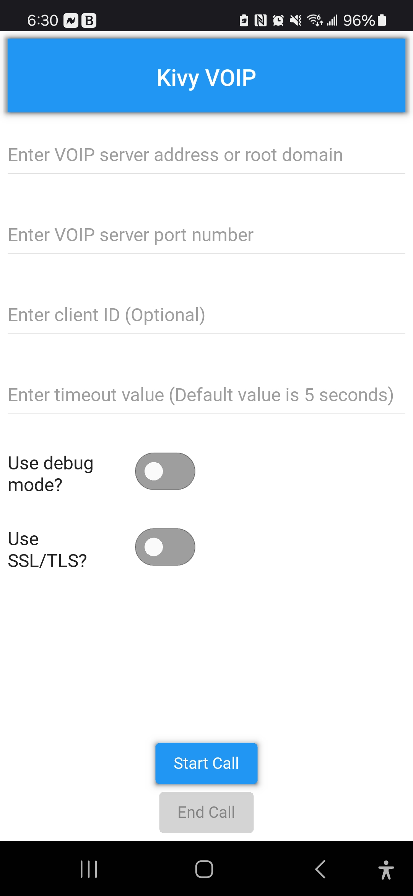

# Kivy VOIP

## Table of Contents

- [Description](#description)
- [App](#app)
- [Usage](#usage)
- [Contributing](#contributing)
- [License](#license)

## Description

Kivy VOIP is a simple, yet powerful framework designed for Kivy app developers to implement Voice Over IP (VOIP) functionality in their applications.
It simplifies the process of setting up voice communication between users, allowing developers to integrate it easily into their Kivy apps.
The main goal of this project is to provide a seamless VOIP experience, enabling direct communication between clients through an easily configurable server.
Caution must be exercised by the developer to prevent sending data to the wrong IP address or root domain.

Key features:
- Real-time voice communication.
- Easy integration with Kivy applications.
- Supports Android platforms (with potential support for iOS).

## App

To quickly test the functionality of the Kivy VOIP module, you may download the bug-free Kivy VOIP mobile application provided in the link(s) below.
For your convenience, front-end input validation is included in the app, but you will need to ensure input into the module is valid for your app.
It is highly recommended to use Android Debug Bridge (ADB) to view the print statements in debug mode to understand or troubleshoot your inputs.
[Download on Google Play](https://play.google.com/store/apps/details?id=app.cyberdefensesolutions.kivyvoip)

## Usage

• To use the Kivy VOIP functionality, you will need to create a server application and configure it to route data sent by clients.
For testing purposes, the node VOIP server in the repository is configured to echo data back to a connected client.
Note that any programming language could be used to create the server. Node.js was chosen due to its popularity and performance.
Here is a basic outline of how to run the generic server application from the repository:

Step 1. Download "node VOIP server.js" from the main repository.
Step 2. If not already installed, install node.js on your operating system.
Step 3. If not already known, discover your server's local IP address by running "ipconfig" (Windows) or "ifconfig" (Linux) in your Command Line Interface (CLI).
Step 4. Run the following command in your CLI to run the VOIP server when desired: node "node VOIP server.js"
It is also possible to run the "node VOIP server.js" through VS Code.

• You will also need to create a client using the voip.py module provided in the main repository.
The main.py file in the main repository provides an example of how to utilize the voip.py module.
Download both main.py and voip.py and place them in the same directory of your choosing.
For the module to work pyjnius is needed, which runs on the Android OS. This will require you to compile main.py and voip.py in the same directory using Buildozer,
which includes pyjnius by default.
Within your buildozer.spec file, update the android.permissions line with the following permissions before compiling:
INTERNET, RECORD_AUDIO, ACCESS_NETWORK_STATE, and WAKE_LOCK.

## Contributing

Contributions are welcome! An IOS implementation is highly desired. Please follow these steps:
1. Fork the repository.
2. Create a new branch for your feature or bug fix.
3. Commit your changes and push your branch.
4. Submit a pull request.

## License

This project's voip.py file is licensed under the MIT License. See the [LICENSE.txt](LICENSE) file for details.